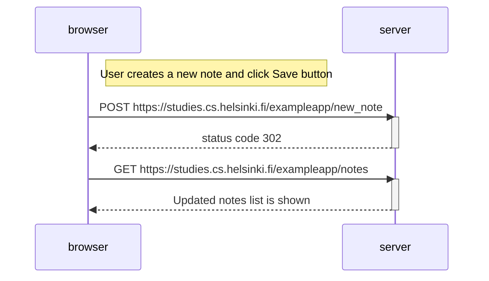

```mermaid
    sequenceDiagram
        participant browser
        participant server

        Note right of browser: User creates a new note and click Save button

        browser->>server: POST https://studies.cs.helsinki.fi/exampleapp/new_note
        activate server
        server-->>browser: status code 302
        deactivate server


        browser->>server: GET https://studies.cs.helsinki.fi/exampleapp/notes
        activate server
        server-->>browser: Updated notes list is shown 
        deactivate server

```